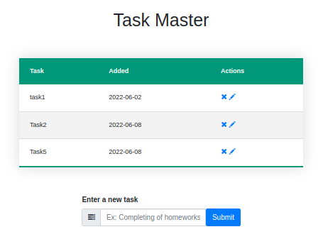

# To Do App

This repo has been develop with Python v3.8 and Flask Framework.

### Requirements

You need to install the following packages:

    * Python v3.8
    * Flask Framework
    * SQLAlchemy

You can install them with the following commands.


### How To Run

1. Install `virtualenv`:

```bash
pip install virtualenv
```

2. Open a terminal in the project root directory and run:

```bash
virtualenv env
```

3. Then run the command:

```bash
.\env\Scripts\activate
```

4. Then install the dependencies:

```bash
(env) pip install -r requirements.txt
```

5. Finally start the web server:

```bash
(env) python app.py
```

This server will start on port 5000 by default. You can change this in `app.py` by changing the following line to this:

```python
if __name__ == "__main__":
    app.run(debug=True, port=<desired port>)
```

### Snapshot

